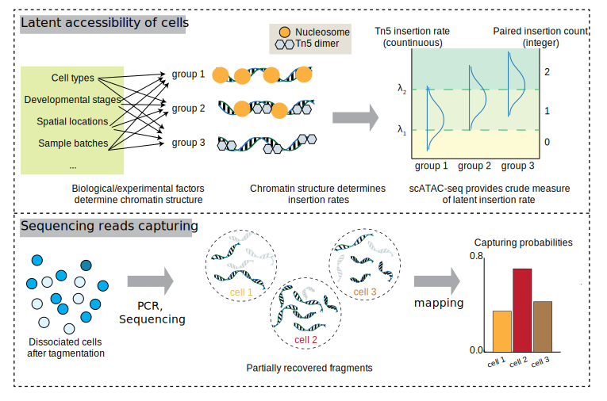

<!-- README.md is generated from README.Rmd. Please edit that file -->

```{r, include = FALSE}
knitr::opts_chunk$set(
  collapse = TRUE,
  comment = "#>",
  fig.path = "man/figures/README-",
  out.width = "100%"
)
```

# PACS



<!-- badges: start -->
<!-- badges: end -->

## PACS (Probabilistic model for Accessible Chromatin data in Single Cell)
PACS is a toolkit for snATAC-seq data analysis.

The key functionalities of PACS include: 

(1) Depth correction for snATAC-seq data. 
(2) Statistical test for complex data design
(3) Supervised cell type annotation (with a reference dataset)
(4) Batch effect correction enabled by statistical test framework

## Installation

You can install the current version of PACS from [GitHub](https://github.com/) with:

``` r
# install.packages("devtools")
devtools::install_github("Zhen-Miao/PICsnATAC") ## dependent package 
devtools::install_github("Zhen-Miao/PACS")
```

This installation step should take `< 5 min` on a standard desktop machine. R version `> 4.0.0` is recommended (older R version has not been tested). 

## Example

This is a basic example which shows you how to run PACS common workflow:

```{r example,eval=FALSE}
library(PACS)

p_vals <- pacs_test_sparse(
  covariate_meta.data = meta.data,
  formula_full = ~ factor(cell_type) + factor(batch),
  formula_null = ~ factor(batch),
  pic_matrix = data_mat,
  cap_rates = capturing_probability
)
```

## Vignette and Interactive Notebooks

An interactive tutorial website with vignettes can be found at

[https://zhen-miao.github.io/PACS/](https://zhen-miao.github.io/PACS/)

Although not recommended, you can also run the analysis using Goolge Colab, with one example shown below:

Notebook 1: [Type 1 error and power evaluation in real data .](https://github.com/Zhen-Miao/PACS/blob/main/vignettes/Notebook_1_Test_For_Sens_Spec_real_kidney_data.ipynb)

## Citation:

Miao, Z., Wang, J., Park, K. Kuang, D. and Kim, J. **Model-based compound hypothesis testing for snATAC-seq data with PACS.** _bioRxiv_ (2023). https://www.biorxiv.org/content/10.1101/2023.07.30.551108v1 

## snATAC-seq toolkits

PACS is one of the snATAC-seq toolkits developed by the Kim lab. Other toolkits include:


* [**PICsnATAC**](https://github.com/Zhen-Miao/PICsnATAC)

Miao, Z and Kim, J. **Uniform quantification of single-nucleus ATAC-seq data with Paired- Insertion Counting (PIC) and a model-based insertion rate estimator.** Nature Methods 2024

## Contact

For any questions regarding the package, please contact Zhen Miao (zhenmiao@pennmedicine.upenn.edu) or Junhyong Kim (junhyong@sas.upenn.edu).

