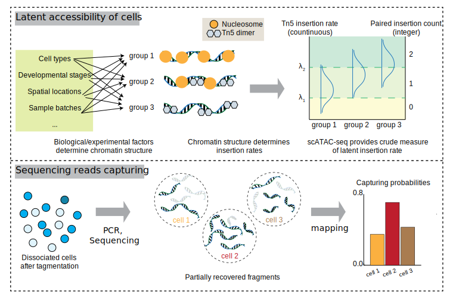

<!-- README.md is generated from README.Rmd. Please edit that file -->

# PACS

<figure>

<figcaption aria-hidden="true">Illustration of PACS
framework.</figcaption>
</figure>

<!-- badges: start -->
<!-- badges: end -->

## PACS (Probabilistic model for Accessible Chromatin data in Single Cell)

PACS is a toolkit for snATAC-seq data analysis.

The key functionalities of PACS include:

1)  Depth correction for snATAC-seq data.
2)  Statistical test for complex data design
3)  Supervised cell type annotation (with a reference dataset)
4)  Batch effect correction enabled by statistical test framework

## Installation

You can install the current version of PACS from
[GitHub](https://github.com/) with:

``` r
# install.packages("devtools")
devtools::install_github("Zhen-Miao/PICsnATAC") ## dependent package 
devtools::install_github("Zhen-Miao/PACS")
```

## Example

This is a basic example which shows you how to run PACS common workflow:

``` r
library(PACS)

p_vals = pacs_test_sparse(
     covariate_meta.data = meta.data,
     formula_full = ~ factor(cell_type) + factor(batch),
     formula_null = ~ factor(batch),
     pic_matrix = data_mat,
     cap_rates = capturing_probability
   )
```

## Vignette and Interactive Notebooks

Vignette 1: [Cell type annotation with
PACS](https://htmlpreview.github.io/?https://github.com/Zhen-Miao/PACS/blob/main/vignettes/Vignette_1_PACS_cell_type_annotation.html)

Vignette 2: [Differentially Accessible Region (DAR) Identification with
PACS](https://htmlpreview.github.io/?https://github.com/Zhen-Miao/PACS/blob/main/vignettes/Vignette_1_PACS_cell_type_annotation.html)

Notebook 1: [Type 1 error and power evaluation in real data
.](https://github.com/Zhen-Miao/PACS/blob/main/vignettes/Notebook_1_Test_For_Sens_Spec_real_kidney_data.ipynb)
